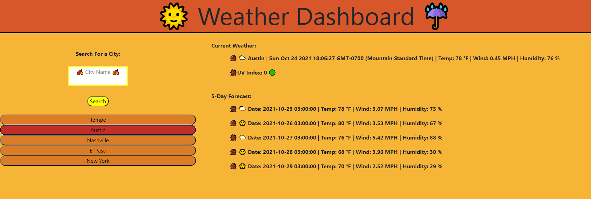

# Weather Dashboard
## Description

This application is intended to enable the user for searching weather by city name. 

## Installation
* None
## Usage
This repository can be opened as an HTML within Github at the website: https://teeemster.github.io/Weather-Dashboard/

The user can key in the city name in the text box and search weather by city. The dashboard will pull the current weather of the city requested, along with a five-day forecast. Emojis are used to indicate if the weather will be clear, rainy, thunderstorm, mist, or cloudy. Prior cities are appended to search history on the web page and can be referenced again by the user if needed.

    
## Credits
* Jonathan Beach

## License
* 

## Badges
  
* 
* 
* 